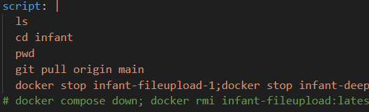
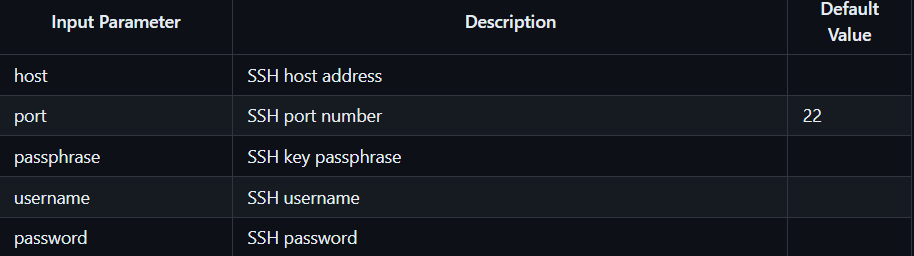
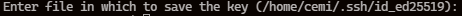
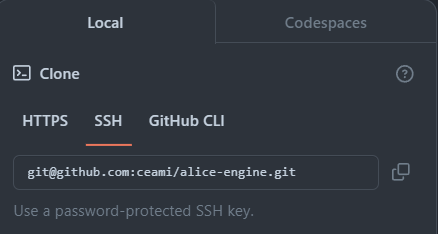

# gitaction-tutorial

## git action ssh를 통한 배포 방법

  ### 깃허브에서 할 것 
  1. 레포지토리 최상단 트리에 .github/workflows 생성
  2. workflows 하위에 [파일이름.yml] 파일 생성
  3. [https://github.com/ceami/infant/blob/main/.github/workflowsbuild-container.yml#L4] 복사\
      - __꼭 이부분( yml파일에 script 부분 )에 올릴때 자동화 하고 싶은 코드 작성__\
        __*~~잘못 적으면 ㅈ댐~~*__
        

      - [원하는 action 템플릿 가져다 쓰기](https://github.com/marketplace/actions/ssh-remote-commands) <- 이건 ssh 템플릿
  4. 레포지토리 Settings 에서 Secrets and variables/ Actions 클릭
  5. 3.단계에서 복사한 코드속 secret key들을 new reposi~ secret 으로 생성
      - 주요 key 들 설명( input_name은 대문자로 작성 ) 
      
  ---
  ### 서버( a6000 )에서 할 것
  6. ssh key 생성 되어있나 확인\
     본인(커밋하는 사람) 깃허브 아이디로 된 id_ed25519 키 쌍 (공용과 비밀)이 있는지 확인 
      ```bash
        cd ~/.ssh
        ls
        # 본인 아이디가 포함된 이름 일 수 있음
        cat id_ed25519.pub 
      ``` 
      commit 하고자 하는 사용자 이름으로 생성 한적이 없다면\
      ~~__무작정 Enter 누르지마!!!__~~
      ```bash
        ssh-keygen -t ed25519 -C "your_email@example.com"
      ```
      아래와 같이 뜬다면 [ __/home/cemi/.ssh/id_ed25519_본인이름__ ] 과 같이 입력\
      __절대 overight 하지 말것__ \
      \
      
      \
      패스워드를 설정할 건지 물어볼 때 _**추가 패스워드**_ 없이 사용하려면 __엔터를 두 번 입력__
      
  7. 아래링크에서 키 등록
      ```bash 
        cat id_ed25519_본인이름.pub
        # 후에 뜨는 모든 텍스트 복사
      ```
    
      Key 란에 위에서 복사한 pub키 입력  \
      [github add new ssh key](https://github.com/settings/ssh/new)
      
---
### 깃허브 아이디 입력 없이 올리기
  8. 인증정보 관리 툴 실행 확인
      ```bash 
        ssh-add -l
        # connection refused 뜨면 안켜진거임
      ```
      no identities나 ssh키 목록이 뜬다면 실행된 상태
  9. 안켜졌다면..
      ```bash 
        eval "$(ssh-agent -s)"
        ssh-add ~/.ssh/id_ed25519_아까만든거
        ssh-add -l
      ```
  10. 마지막 
      ```bash 
        ssh -T git@github.com
        git remote set-url origin [url]
      ```
        __*url 부분에__ 
         복사
      
---
  ### 만약 오류가 뜬다면!!

  __명시적으로 config 파일을 만들어야 할 수도 있음(없다면)__ 
  ```bash
    cd ~/.ssh
    vi config
  ``` 
  밑에 복붙
  ```bash 
    Host github.com
      IdentityFile ~/.ssh/id_ed25519_Yshgodd
      User git
  ```
  <details>
  <summary> 더 자세한 설명</summary>
  
  \
  [원문 사이트](https://kim-zzaisang.tistory.com/28)

  - SSH config 에 GitHub.com-{github-id}반영
    config 파일 접근 (없으면 생성)
    vi ~/.ssh/config

    하위 내용 추가

    Host github.com-zzaisang # zzaisang -> 사용하는 GitHub ID
    HostName github.com
    User git
    IdentityFile ~/.ssh/id_rsa_github
    권한 추가

    chmod 440 ~/.ssh/config 
    Git clone 사용 시 URL 에 계정 정보 추가 후 복사
    Git clone 명령어를 사용해서 Git을 로컬에 복사하는 과정입니다.
    GitHub의 Repository에서 Clone 명령어에서 "SSH"를 선택하면 clone 할 URL을 표시해줍니다.
    Git Repository URL을 git@github.com-{your_id}:{your_id}/{repo_name}.git 와 같이 입력합니다.

    GitHub에서 복사한 URL: git@github.com:{your_id}/{repo_name}.git
    수정해야 하는 URL: git@github.com-{your_id}:{your_id}/{repo_name}.git
    수정 예: git@github.com-zzaisang:zzaisang/test.git

    clone 시 url를 config에 지정한 Host정보로 변경
    git clone git@github.com:zzaisang/study_zzaisang.git ## AS-IS 방식
    git clone git@github.com-zzaisang:zzaisang/study_zzaisang.git ## To-BE 방식
</details>


  

  [로그인을 계속 요청한다면](https://velog.io/@kimjiwonpg98/git-git%EA%B6%8C%ED%95%9C%EC%9D%B4-%EC%97%86%EB%8B%A4%EB%A9%B0-push%EA%B0%80-%EC%95%88%EB%90%A0-%EB%95%8C-ssh%EC%82%AC%EC%9A%A9%EB%B2%95) \
  [내가 처음부터 따라한 블로그 1](https://www.lainyzine.com/ko/article/creating-ssh-key-for-github/)\
  [내가 처음부터 따라한 블로그 2](https://doooodle932.tistory.com/163)


  ## vi 편집기 방향키 오류 나거나 암튼 어쩌구

  ```bash
    cd ~;vi .exrc
  ```
  vi 에서
  ```bash
    set bs=2
    set nocp
  ```
  저장후
  ```bash
    source .exrc
  ```